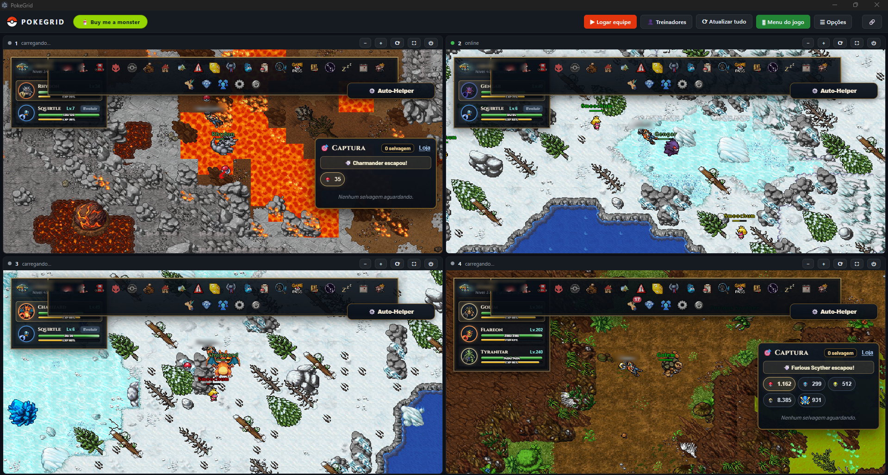

<div align="center">


# PokeGrid

**Four Poke Idle World accounts in a single window.**

[](https://github.com/soufoka/PokeGrid/releases/latest)
[](https://github.com/soufoka/PokeGrid/releases/latest)


[](LICENSE)

[**Download**](https://github.com/soufoka/PokeGrid/releases/latest) · [Português](README.md)



</div>

> Playing an idle game with several accounts usually turns into window juggling: four browsers open, each one logged in by hand, and then guessing which tab belongs to whom. PokeGrid puts them all on one screen, with sessions properly kept apart.

## Why this exists

Poke Idle World rewards continuous progress, so running more than one account makes sense. The problem is not the game, it is the logistics around it.

Regular browser tabs do not work, because they all share the same cookies: signing into the second account kicks the first one out. Separate incognito windows fix the isolation but lose your login every time you close them, waste memory, and leave you hunting for which window is which.

PokeGrid solves all three at once: real per-account isolation, sessions that survive closing the app, and everything visible in one grid.

## How it works, in plain English

Each panel is an independent browser inside the same window. They do not talk to each other: separate cookies, storage and login, so four accounts coexist without stepping on each other.

You save the e-mail and password for each account once. From then on the app fills the form and signs in by itself. If a session drops mid-farm, it notices and logs back in while you are away.

Because four games running at once are heavy, Eco mode caps each panel at 15 frames per second. For an idle game that changes nothing about progress and cuts CPU usage considerably.

## Features

- **Isolated sessions.** Every panel has its own cookies and login. Accounts never mix.
- **Auto login.** Save the credentials once. It signs in by itself, including when the session expires mid-farm.
- **Eco mode.** Caps the games at 15 fps, cutting CPU and GPU usage without affecting progress.
- **Per-panel power.** Unload an account you are not using and get the memory back instantly.
- **Hideable game menu.** The icon bar eats space in a small panel. `F2` toggles it.
- **Chat closed by default.** With a toggle to bring it back whenever you want.
- **No promo popup.** The ad that shows on every login is dismissed automatically.
- **Keep awake.** Stops Windows from sleeping while you farm overnight.
- **System tray.** Minimizes next to the clock and can start with Windows, already farming.
- **Portuguese and English.** One click switches the language of the interface and of the game itself.
- **Per-panel zoom**, full screen expand and `Ctrl+1` to `Ctrl+4` shortcuts.

## Getting started

Download the `.zip` from the [latest release](https://github.com/soufoka/PokeGrid/releases/latest), extract the whole folder and run `PokeGrid.exe`. No Node, no install.

1. Log in or create an account in each panel.
2. Open **Treinadores** (Accounts) and save each account's e-mail and password.

That is it. Next time it signs in on its own.

Running from source:

```bash
git clone https://github.com/soufoka/PokeGrid.git
cd PokeGrid
npm install
npm start
```

## Architecture

Each panel is an Electron `<webview>` with its own persistent partition (`persist:conta1` through `persist:conta4`). The partition is what guarantees isolation: cookies, `localStorage` and session live in separate folders on disk, which is why accounts do not kick each other out and stay logged in between launches.

Everything the game does not offer is done through scripts injected into each panel:

| Feature | How it is done |
|---|---|
| Eco mode | Replaces the page's `requestAnimationFrame` with a throttled version, capping the frame rate |
| Auto login | Fills the fields through the native `HTMLInputElement` value setter, required for the game's React state to register the change |
| Game menu and chat | Toggle element visibility, with a `MutationObserver` to reapply it when the game repaints its interface |
| Promo popup | Triggers the game's own close button the moment it appears |

`F2` is registered inside the game page rather than as an Electron menu accelerator. Menu accelerators do not fire while the `webview` holds keyboard focus, so this is the only way for the key to respond while you play.

## Security

- **Passwords encrypted on your machine.** Electron's `safeStorage` uses the operating system's own API (DPAPI on Windows). Passwords never leave the computer and never reach this repository.
- **Atomic writes with backup.** The accounts file is written to a temporary file and swapped in one step, and an unreadable file is preserved before anything overwrites it.
- **Panels locked to the game's domain.** Any external link opens in your real browser, and credentials are only typed into the official login URL.
- **Permissions denied.** Microphone, camera, geolocation and notifications are blocked for the panels.
- **You always solve the captcha.** The app fills the fields and presses Enter the moment you tick the box, but it never touches the "Confirm you are human" widget. Defeating bot detection is not what this project is for.

## Structure

```
PokeGrid/
├── main.js       main process: window, tray, shortcuts, IPC and account encryption
├── preload.js    isolated bridge between the interface and the main process
├── index.html    interface, state and the scripts injected into the panels
├── tray.png      tray icon
└── docs/         README images
```

## Roadmap

Ideas not shipped yet, ordered by usefulness:

- Watchdog: automatically reload a panel that freezes or loses connection, and warn from the tray
- Choose which panels open on start, to farm with fewer than four accounts
- Farm uptime counter per panel
- Remember the layout and the expanded panel between launches

## License

[MIT](LICENSE). Independent project, not affiliated with Poke Idle World.
