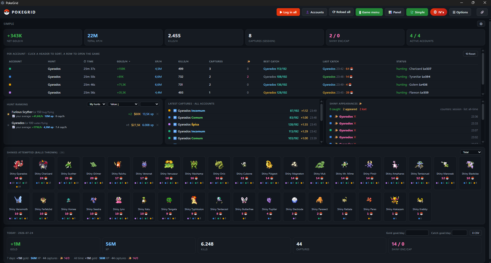

# PokeGrid

**Quatro contas de Poke Idle World em uma janela só.**

[**Baixar**](https://github.com/soufoka/PokeGrid/releases/latest) · [English](README.en.md)

Modo Simples: esconde o jogo e mostra só os números. Cada seção pode ser movida e redimensionada.

> ### 🔒 Seus dados de login ficam só no seu computador
> Login e senha são criptografados no seu próprio PC e nunca saem dele. Nada de servidor, nada de repositório. O código está todo aqui pra você conferir.

## O que é

Quatro contas rodando ao mesmo tempo, cada uma no seu quadrante e com sessão separada. Você salva o login uma vez e o app entra sozinho nas próximas. Se a sessão cair no meio do farm, ele loga de novo sem você precisar estar por perto. Ele não automatiza o jogo nem toca no captcha, só organiza as contas que você já tem.

## Como instalar

Na [última versão](https://github.com/soufoka/PokeGrid/releases/latest), em **Assets**, baixe o arquivo do seu sistema:

- Windows: `PokeGrid-Setup-….exe` (instalador), `PokeGrid-…-portable.exe` (portátil, abre sem instalar) ou `PokeGrid-…-win.zip` (extrair e abrir).
- macOS: `PokeGrid-…-arm64.dmg` (Mac com chip Apple, M1 em diante) ou `PokeGrid-….dmg` (Mac com Intel).
- Linux: `PokeGrid-….AppImage`.

Abra, entre ou crie uma conta em cada painel e, em **👤 Treinadores**, salve o login. Da próxima vez ele entra sozinho.

> **O Windows mostrou "O Windows protegeu o PC"?** É o aviso do SmartScreen para programa sem assinatura digital: o certificado é pago, e o projeto é gratuito. Clique em **Mais informações** e depois em **Executar assim mesmo**. Se o navegador segurar o download, escolha **Manter**. Cada versão sai de uma compilação pública no GitHub Actions, com a varredura do Windows Defender no log. Baixe só daqui, de github.com/soufoka.

> **No Mac, apareceu que o app não pode ser aberto?** Abra **Ajustes do Sistema > Privacidade e Segurança** e clique em **Abrir mesmo assim**. Se aparecer que o app está danificado, rode no Terminal `xattr -cr /Applications/PokeGrid.app` e abra de novo. É o mesmo motivo do Windows: o app não tem assinatura da Apple.

Quando sai versão nova, o app avisa ao abrir, e o botão **Baixar** traz de volta pra página de download. Instale por cima, ou troque o portátil pelo novo: contas, configurações, scripts e histórico ficam fora do programa e continuam lá.

No Linux, se o AppImage só abrir com `--no-sandbox`, veja o [FAQ](FAQ.md).

> Prefere não rodar um executável? A [versão sem executável](https://github.com/soufoka/PokeGrid-source) é o mesmo app rodando direto do código: você baixa, confere o que ele faz e abre com o Node.js.

## O que ele faz

- Rode de 1 a 4 contas, você escolhe quantos painéis abrir.
- Login automático, mesmo quando a sessão expira no meio do farm.
- 🍃 Simples: esconde os jogos e mostra só os números das contas (gold e XP por hora, totais do dia, capturas, shinies, inventário), gastando bem menos do PC.
- Tierlist por elemento e por Pokémon, sugestão de hunt e o painel do Ditto, que se ajustam ao que as suas contas farmam.
- Calculadora de IV e venda protegida, que pede confirmação antes de vender shiny, Lendária ou item raro.
- Avisa quando aparece shiny, uma conta cai, para de farmar ou fica sem suprimento, por notificação e no Discord.
- Modo Eco, que segura o uso de CPU sem atrapalhar o progresso, e esconde o chat e o menu de ícones do jogo pra sobrar tela.
- Liga e desliga cada painel, zoom e expandir por painel, e atalhos de teclado.
- Bandeja, abrir junto com o Windows e idioma português, inglês ou espanhol.

## Documentação

| | |
|---|---|
| **[Manual](MANUAL.md)** | O que cada botão e cada seção faz, em linguagem simples |
| **[FAQ](FAQ.md)** | Dúvidas frequentes: atualizar sem perder nada, aviso de vírus, pokébola sumida, scripts, planilhas |
| **[Mudanças](CHANGELOG.md)** | O que entrou em cada versão |

## Segurança

- As senhas são criptografadas pelo `safeStorage` do Electron, que usa a API do sistema (DPAPI no Windows). Nunca saem do PC.
- Os painéis ficam presos ao domínio do jogo. Link externo abre no seu navegador, e a senha só é digitada na tela de login oficial.
- Câmera, microfone, localização e notificações do jogo ficam bloqueados.
- O captcha é sempre você que resolve. O app preenche e aperta Entrar quando você marca a caixinha, mas nunca toca no "Confirme que é humano". Burlar detecção de bot não é a proposta.

## Por dentro

Cada painel é um `<webview>` do Electron com partição própria (`persist:conta1` até `conta4`), e é isso que mantém as contas isoladas e logadas entre aberturas. O que o jogo não oferece, o app injeta em cada painel: o Eco troca o `requestAnimationFrame` por uma versão mais lenta, o login preenche pelo setter nativo do input, e o menu e o chat somem via CSS com um `MutationObserver`. Está tudo em `main.js`, `preload.js` e `index.html`, sem nada escondido.

## Licença

MIT. Projeto independente, sem ligação com o Poke Idle World.
